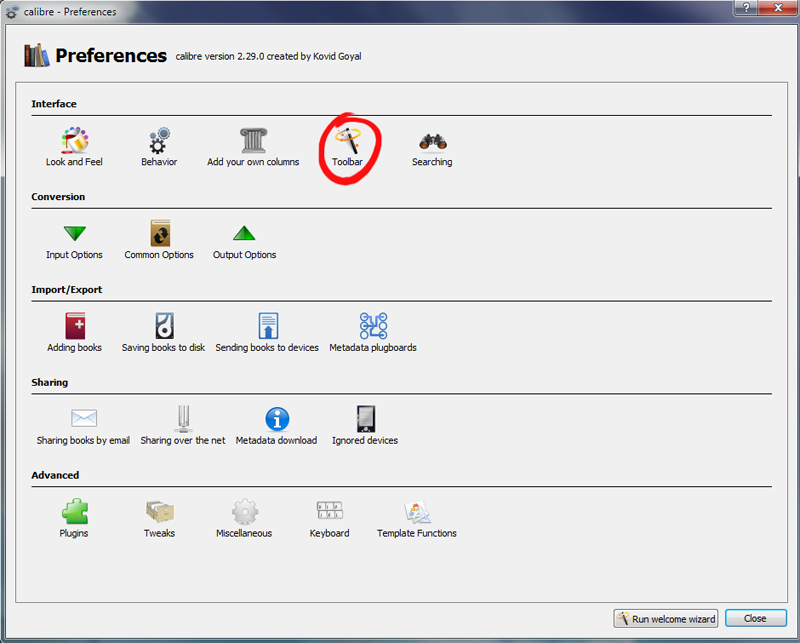

Calibre is by far the best tool available to manage an ebook library. And it's a free, open-source software. That's why it's widely used. And you will probably want to share the books you already organized with Calibre through Ubooquity. Good news: to do that you just have to share your Calibre library folder. Ubooquity is completely compatible with Calibre and even reads Calibre-specific informations like book rating or book series name. There are however a few (easily avoidable) pitfalls you might encounter. They are detailed here, with their solution.

## Write metadata to epub files

Calibre allows you to edit all sorts of metadata (title, authors, description, rating, etc.), but the changes you make are stored in Calibre own database, not in the files themselves. Since Ubooquity relies entirely on epub files and has no interaction with the Calibre database, you must force Calibre to write its metadata to the files.

This is done using the **Embed metadata** option. To add this command to your Calibre toolbar, follow these simple steps.

1. Open the Calibre *preferences* window and click the *toolbar* button

2. Select the *Main Toolbar* in the toolbar list

3. Find the *Embed Metadata* button and add it to your toolbar

Once you have added the button, select the ebooks on which you did metadata modifications and click it.  
After that, don't forget to refresh your collection in Ubooquity using the *Launch new scan* button if you disabled periodic auto-refresh.

## Remove duplicate epub files

Sometimes you'll see the same ebook appear multiple times in Ubooquity whereas you have only one corresponding line in Calibre. This happens when Calibre fails to rename or update an epub file, especially when working on a shared drive (the Calibre documentation [strongly advises against using network drives](http://manual.calibre-ebook.com/faq.html#i-am-getting-errors-with-my-calibre-library-on-a-networked-drive-nas) to host your library). Two or more epub files are then created in Calibre library.

While Calibre references (and displays) only one of these files, Ubooquity has no way to know that some of them are duplicates of the same book and must be ignored. This problem can be easily fixed by removing the duplicate files, with the help of Calibre maintenance tool.

In the Calibre toolbar, click on your library and choose **Library** -> **Maintenance** -> **Check library**

After the database check, Calibre will ask if you want to check if your files match what is in the database: _"Found no errors in your calibre library database Do you want calibre to check if the files in your library match the information in the database?"_

Click **yes**. You will find the duplicates in the Extra book formats section of the result screen.

Check all the extra files and click the **Delete marked** button.  
After that, don't forget to refresh your collection in Ubooquity using the **Launch new scan** button if you disabled periodic auto-refresh.
